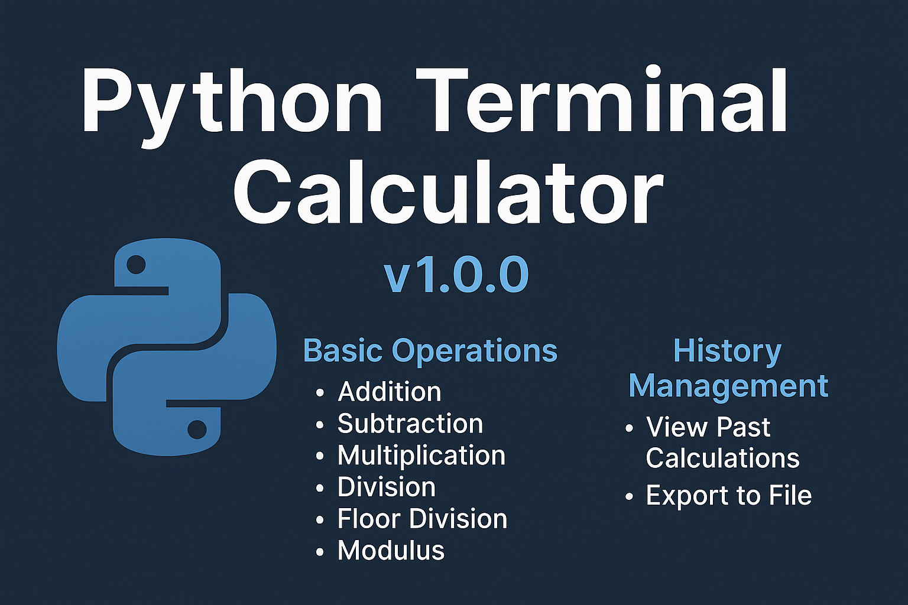

<p align="center">
  
</p>

# 🧮 Smart CLI Calculator

## 🔖 GitHub Topics

[](https://github.com/topics/python)
[](https://github.com/topics/cli)
[](https://github.com/topics/command-line)
[](https://github.com/topics/calculator)
[](https://github.com/topics/terminal-app)


---

A command-line calculator built with Python that supports basic arithmetic operations, exponentiation, modulus, floor division, calculation history tracking, and export to file. Beginner-friendly and organized with object-oriented principles.

---

## 🧠 Features

- ➕ Addition, ➖ Subtraction, ✖️ Multiplication, ➗ Division
- ✅ Floor Division, Modulus, Exponentiation
- 📜 Full calculation history tracking
- 💾 Export history to a `.txt` file
- 🚫 Handles division by zero with proper error messages
- 📂 Organized with class-based design (OOP)
- 👤 Personalized user greeting
- 🖥️ Cross-platform terminal clearing

---

## 🗂️ Project Structure

```

calculator-cli-app/
│
├── calculator/                 # Source code
│   ├── calculator.py           # Main calculator program
│   └── sample_history.txt      # Sample exported history format
│
├── .gitignore                  # Files to ignore in version control
├── LICENSE                     # MIT License
├──banner.png                   # banner file
├── README.md                   # Project documentation
└── tests/
    └── test_placeholder.py     # Future test cases placeholder

```

---

## 🚀 How to Run

Make sure you have Python installed. Then open a terminal and run:

```bash
cd calculator
python calculator.py
```

---

## 📜 License

This project is licensed under the [MIT License](./LICENSE).

---

## 💡 Contributions

Pull requests are welcome. For major changes, please open an issue first to discuss what you would like to change.

---

## 🔖 Tags for GitHub Topics (for better discovery)

```txt
python, calculator, cli, command-line, arithmetic, terminal-app, beginner-friendly, python3, open-source, oop
